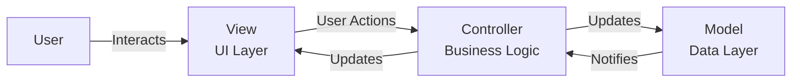
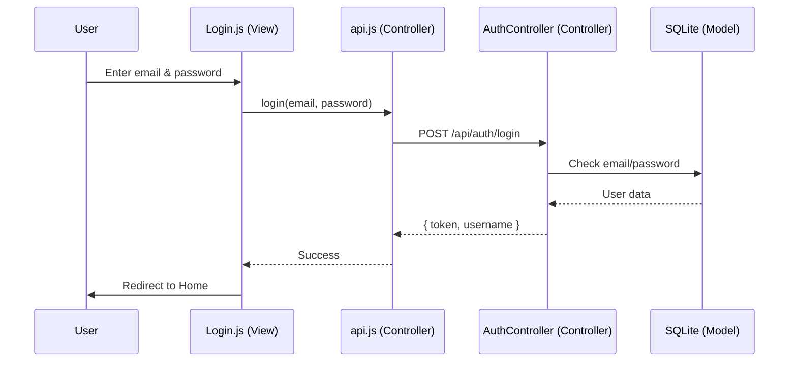

# SportsTogether - Architecture & MVC Implementation Guide

## Table of Contents
1. [What is MVC?](#what-is-mvc)
2. [Backend (ASP.NET Core) - MVC Implementation](#backend-mvc)
3. [Frontend (React) - Component-Based Architecture](#frontend-architecture)
4. [How They Work Together](#integration)
5. [Code Flow Examples](#code-flow)

---

## What is MVC?

**MVC** stands for **Model-View-Controller**. It's a design pattern that separates an application into three interconnected components:



- **Model**: Represents the data and business logic (e.g., User, Game objects).
- **View**: The user interface (what the user sees).
- **Controller**: Handles user input, updates the Model, and sends data to the View.

**Why MVC?**
- **Separation of Concerns**: Each part has a single responsibility.
- **Testability**: Easy to test each component independently.
- **Scalability**: Easy to add new features without breaking existing code.

---

## Backend (ASP.NET Core) - MVC Implementation

Your backend follows the **classic MVC pattern**:

### Folder Structure
```
SportsTogether.API/
├── Models/              ← MODEL (Data)
│   ├── User.cs
│   └── Game.cs
├── Controllers/         ← CONTROLLER (Logic)
│   ├── AuthController.cs
│   └── GamesController.cs
├── Data/               ← MODEL (Database Access)
│   └── AppDbContext.cs
└── Program.cs          ← Configuration
```

### 1. **Model** (Data Layer)
**Location**: `Models/User.cs`, `Models/Game.cs`

**Purpose**: Define the structure of your data.

**Example** ([User.cs](file:///c:/Users/wongj/OneDrive/Documents/USM/y4s1/FYP/SportsTogether_Project/SportsTogether.API/Models/User.cs)):
```csharp
public class User
{
    public int Id { get; set; }
    public string Username { get; set; }
    public string Email { get; set; }
    public string PasswordHash { get; set; }
    public string Role { get; set; }
}
```

This is a **Plain Old CLR Object (POCO)**. It represents a row in the `Users` table.

**Entity Framework Core (EF Core)** acts as the bridge:
- `AppDbContext.cs` tells EF Core which Models map to which database tables.
- EF Core generates SQL queries for you (you never write `SELECT * FROM Users` manually).

### 2. **Controller** (Business Logic)
**Location**: `Controllers/AuthController.cs`, `Controllers/GamesController.cs`

**Purpose**: Handle HTTP requests, call the Model, and return responses.

**Example** ([AuthController.cs](file:///c:/Users/wongj/OneDrive/Documents/USM/y4s1/FYP/SportsTogether_Project/SportsTogether.API/Controllers/AuthController.cs#L26-L47)):
```csharp
[HttpPost("register")]
public async Task<IActionResult> Register([FromBody] RegisterRequest request)
{
    // 1. Business Logic: Check if email exists
    if (await _context.Users.AnyAsync(u => u.Email == request.Email))
        return BadRequest(new { message = "Email already exists" });

    // 2. Interact with Model: Create new User
    var user = new User
    {
        Username = request.Username,
        Email = request.Email,
        PasswordHash = BCrypt.Net.BCrypt.HashPassword(request.Password)
    };

    // 3. Save to Database
    _context.Users.Add(user);
    await _context.SaveChangesAsync();

    // 4. Return Response (View equivalent)
    return Ok(new { message = "User registered successfully" });
}
```

**Key Points**:
- `[HttpPost("register")]` maps this function to `POST /api/auth/register`.
- `_context` is the **Model layer** (database access).
- `IActionResult` is the **View layer** (returns JSON to the frontend).

### 3. **View** (API Responses)
In a **Web API**, the "View" is not an HTML page—it's **JSON data**.

When you call `return Ok(new { token, username })`, ASP.NET Core automatically converts this to:
```json
{
  "token": "eyJhbGciOiJIUzI1NiIsInR5cCI6IkpXVCJ9...",
  "username": "JohnDoe"
}
```

---

## Frontend (React) - Component-Based Architecture

React doesn't use traditional MVC. Instead, it uses a **Component-Based** architecture, but we **organize it like MVC** for clarity.

### Folder Structure
```
frontend/src/
├── pages/              ← VIEW (Full Pages)
│   ├── Home/Home.js
│   └── Login/Login.js
├── components/         ← VIEW (Reusable Parts)
│   ├── Navbar/
│   ├── Hero/
│   └── GameCard/
├── services/           ← CONTROLLER (API Calls)
│   └── api.js
└── styles/             ← VIEW (CSS)
    └── main.css
```

### How It Maps to MVC:

| React Concept | MVC Equivalent | Example |
| --- | --- | --- |
| **Pages** (`Home.js`, `Login.js`) | **View** | Full screens the user sees |
| **Components** (`Navbar.js`, `GameCard.js`) | **View** | Reusable UI parts |
| **Services** (`api.js`) | **Controller** | Fetches data from backend |
| **State** (`useState`, `useEffect`) | **Model** | Local data storage |

### 1. **View** (UI Layer)
**Location**: `pages/Home/Home.js`, `components/Navbar/Navbar.js`

**Purpose**: Display data to the user.

**Example** ([Home.js](file:///c:/Users/wongj/OneDrive/Documents/USM/y4s1/FYP/SportsTogether_Project/frontend/src/pages/Home/Home.js#L6-L17)):
```javascript
const Home = () => {
    const [games, setGames] = useState([]); // ← Local "Model"

    useEffect(() => {
        const loadGames = async () => {
            const data = await fetchGames(); // ← Call "Controller"
            setGames(data);                  // ← Update "Model"
        };
        loadGames();
    }, []);

    return (
        <div className="games-grid">
            {games.map(game => (
                <GameCard key={game.id} game={game} /> // ← Render "View"
            ))}
        </div>
    );
};
```

### 2. **Controller** (API Service)
**Location**: `services/api.js`

**Purpose**: Communicate with the backend API.

**Example** ([api.js](file:///c:/Users/wongj/OneDrive/Documents/USM/y4s1/FYP/SportsTogether_Project/frontend/src/services/api.js#L3-L13)):
```javascript
export const fetchGames = async () => {
    const response = await fetch('http://localhost:5000/Games');
    return await response.json();
};

export const login = async (email, password) => {
    const response = await fetch('http://localhost:5000/api/auth/login', {
        method: 'POST',
        body: JSON.stringify({ email, password })
    });
    return await response.json();
};
```

This is the **Controller** layer. It doesn't care about UI—it just talks to the backend.

### 3. **Model** (State Management)
**Location**: `useState()` in components

**Purpose**: Store and manage local data.

**Example**:
```javascript
const [isAuthenticated, setIsAuthenticated] = useState(false); // ← Model
```

In larger apps, you might use **Context API** or **Redux** for global state, but for now, local state works.

---

## How They Work Together

### Full Request Flow: User Logs In



### Breakdown:
1. **User** enters email/password in [Login.js](file:///c:/Users/wongj/OneDrive/Documents/USM/y4s1/FYP/SportsTogether_Project/frontend/src/pages/Login/Login.js) (**View**).
2. [Login.js](file:///c:/Users/wongj/OneDrive/Documents/USM/y4s1/FYP/SportsTogether_Project/frontend/src/pages/Login/Login.js#L25-L32) calls `login()` from [api.js](file:///c:/Users/wongj/OneDrive/Documents/USM/y4s1/FYP/SportsTogether_Project/frontend/src/services/api.js#L16-L29) (**Controller**).
3. [api.js](file:///c:/Users/wongj/OneDrive/Documents/USM/y4s1/FYP/SportsTogether_Project/frontend/src/services/api.js) sends HTTP request to backend.
4. [AuthController.cs](file:///c:/Users/wongj/OneDrive/Documents/USM/y4s1/FYP/SportsTogether_Project/SportsTogether.API/Controllers/AuthController.cs#L49-L61) (**Backend Controller**) receives request.
5. Backend queries `AppDbContext` (**Model**) to check database.
6. Database returns user data.
7. Backend generates JWT token and sends JSON response.
8. Frontend receives token and stores it in `localStorage`.
9. User is redirected to Home page.

---

## Code Flow Examples

### Example 1: Fetching Games

**Frontend**:
```javascript
// 1. View calls Controller
const data = await fetchGames(); // services/api.js
```

**Backend**:
```csharp
// 2. Controller queries Model
[HttpGet]
public IEnumerable<Game> Get()
{
    return _context.Games.ToList(); // Model (Database)
}
```

**Result**: Games displayed in [Home.js](file:///c:/Users/wongj/OneDrive/Documents/USM/y4s1/FYP/SportsTogether_Project/frontend/src/pages/Home/Home.js).

### Example 2: User Registration

**Frontend**:
```javascript
// 1. User fills form (View)
// 2. View calls Controller
await register(username, email, password); // services/api.js
```

**Backend**:
```csharp
// 3. Controller creates Model
var user = new User { Username = username, Email = email };

// 4. Save to Database
_context.Users.Add(user);
await _context.SaveChangesAsync();

// 5. Return response (View equivalent)
return Ok(new { message = "Success" });
```

---

## Summary

### Backend (Classic MVC)
- **Model**: `Models/User.cs`, `Data/AppDbContext.cs` (Database objects).
- **Controller**: `Controllers/AuthController.cs` (Business logic).
- **View**: JSON responses (API output).

### Frontend (Component-Based MVC)
- **Model**: React State (`useState`, `localStorage`).
- **Controller**: `services/api.js` (API calls).
- **View**: `pages/`, `components/` (UI).

### Why This Matters for Your FYP
- **Clean Architecture**: Easy to explain and defend in your presentation.
- **Scalability**: Adding new features (e.g., Rewards, Community Feed) follows the same pattern.
- **Industry Standard**: This is how real-world apps are built (e.g., Facebook, Twitter).
